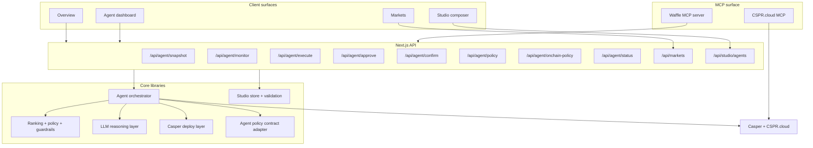

# Waffle Trade

**Autonomous DeFi agents for Casper — from monitoring and reasoning to simulation and execution.**

Waffle Trade is a Casper-first agent platform that turns passive wallets into active, policy-driven portfolio managers.

It combines:

- **live Casper data** from `CSPR.cloud`
- **LLM-guided reasoning** with guardrails
- **MCP-native tooling** for structured protocol access
- **on-chain execution** for staking and LP flows
- **custom agent composition** through Studio

Waffle Trade is not just a dashboard. It is a full stack for **observing**, **deciding**, **simulating**, and **executing** DeFi behavior.

---

## What it does, in one loop

```text
        ┌────────────────────────────────────────────────────────────┐
        │                                                            │
        ▼                                                            │
   ┌─────────┐      ┌──────────┐      ┌──────────┐      ┌──────────┐ │
   │ MONITOR │ ───► │  DECIDE  │ ───► │  APPROVE │ ───► │ REBALANCE│ ┘
   └─────────┘      └──────────┘      └──────────┘      └──────────┘
   live CSPR.cloud  rank + policy     LLM verdict +     delegate /
   staking data     + guardrails      hybrid signing    redelegate on-chain
```

1. **Monitor** — pull live, indexed Casper data from **CSPR.cloud** (validators, auction metrics, delegation rewards, DEX swaps) and normalize it into comparable yield snapshots.
2. **Decide** — rank venues by **risk-adjusted APY**, apply a user-configurable **policy**, run hard **guardrails**, and produce a concrete rebalance proposal with reasoning. An LLM reviews the move and can veto it.
3. **Approve** — auto-sign small moves with a session key, or route larger moves through **Casper Wallet** approval.
4. **Rebalance** — execute staking or LP actions on-chain, confirm them, and surface the result back through the product.

---

## Vision

We believe the next generation of DeFi products will not be managed manually.

Users should not have to continuously monitor markets, compare yields, evaluate risk, and manually route capital themselves. As on-chain ecosystems become more complex, the winning interface is not a better table — it is a better agent.

Waffle Trade is building that agent layer for Casper:

- start with autonomous yield routing
- expand into protocol-aware DeFi automation
- give users and teams a **Studio** to build their own agents
- support simulation before live execution
- evolve toward reusable execution rails, including delegated flows such as `x402`

---

## What Waffle Trade includes

### 1. Overview

The command center for the product.

- live product summary cards
- top venues and allocation context
- activity feed
- quick navigation into the agent and market surfaces

### 2. Agent

The autonomous control room.

- loads real Casper account balance + delegations
- ranks opportunities by risk-adjusted yield
- proposes moves with reasoning
- supports small auto-signed moves
- routes larger moves through Casper Wallet approval
- tracks decisions and execution history

### 3. Markets

A dedicated Casper market intelligence page.

- tracks CEX / DEX market pairs
- filters by venue and contract type
- shows price, 24h change, volume, OI, fees, and links
- exports visible rows to CSV
- includes exchange branding in the table UI

### 4. Studio

The custom agent builder.

- visual agent composition surface
- LLM, MCP, Skill.md, logic, and execution blocks
- file-backed persistence for saved agents
- dry-run / simulation workflow
- deployment-oriented execution rail metadata

---

## The core loop

Waffle Trade is built around a four-step automation loop:

```text
MONITOR → DECIDE → APPROVE → REBALANCE
```

### Monitor
- pull live Casper staking, delegation, and DEX context from `CSPR.cloud`
- normalize yields into comparable snapshots
- inspect current wallet positions

### Decide
- rank venues by **risk-adjusted APY**
- apply policy constraints
- let an LLM review the candidate move
- allow the LLM to veto execution

### Approve
- auto-sign small moves with a session key
- route larger moves through **Casper Wallet**
- record agent intent when the on-chain policy contract is configured

### Rebalance
- delegate / redelegate on Casper
- execute CSPR.trade LP entry and exit flows
- confirm transactions and expose explorer proof links

---

## What this project proves

| Pillar | What is implemented |
| --- | --- |
| **Casper-native reads** | Real account, validator, staking, rewards, DEX, and reserve data via `CSPR.cloud` |
| **Casper-native writes** | Native Casper transactions built with `casper-js-sdk` v5 |
| **MCP-native agent tooling** | Local MCP server plus support for the hosted `CSPR.cloud` MCP server |
| **Autonomous loop** | Scheduler-driven monitor → decide → execute pipeline |
| **Studio agent composition** | Save, edit, simulate, and inspect custom agent graphs |
| **Own contract surface** | Waffle Trade Agent Policy contract deployed on Casper testnet |

---

## Product surfaces

### Marketing site

The landing experience explains:

- Waffle Trade’s product loop
- autonomy model
- safety model
- MCP-native architecture
- vision for intelligent DeFi agents

### Dashboard

The authenticated / product surface includes:

- `/dashboard` → Overview
- `/dashboard/agent` → Agent
- `/dashboard/markets` → Markets
- `/dashboard/studio` → Studio

---

## Architecture



---

## Feature breakdown

### Agent engine

### Live data layer

Waffle Trade reads real Casper data through `CSPR.cloud`, including:

- validators
- auction metrics
- delegator rewards
- account balances
- delegations
- DEXes and swaps
- reserve / token ownership data used for LP pricing

Key files:

- `src/lib/casper/csprcloud.ts`
- `src/lib/casper/positions.ts`
- `src/lib/casper/normalize.ts`
- `src/lib/casper/snapshots.ts`
- `src/lib/casper/reserves.ts`

### Decision engine

The deterministic policy layer remains the source of truth.

It handles:

- venue ranking
- risk-adjusted APY scoring
- min-yield-delta checks
- allocation caps
- cooldown logic
- max move sizing

Key files:

- `src/lib/rebalance/rank.ts`
- `src/lib/rebalance/policy.ts`
- `src/lib/rebalance/guardrails.ts`

### LLM verdict layer

The model does not invent execution numbers.

Instead, it receives the already-computed proposal context and returns a structured verdict:

- `proceed`
- `hold`
- rationale
- confidence

Supported providers:

- OpenAI
- Anthropic / Claude

Key file:

- `src/lib/agent/llm.ts`

### Execution layer

Execution currently supports:

- staking delegation / redelegation
- CSPR.trade LP entry
- CSPR.trade LP exit
- session-key auto signing for small moves
- Casper Wallet approval for larger moves

Key files:

- `src/lib/casper/deploy.ts`
- `src/lib/casper/dex.ts`
- `src/lib/agent/lp.ts`
- `src/lib/casper/keys.ts`

### Background scheduler

Waffle Trade can run without the dashboard being open.

The scheduler:

- starts on server boot
- ticks on a configured interval
- reads persisted state
- runs the monitor → decide → execute loop
- reports health and last summary through `/status`

Key files:

- `src/instrumentation.ts`
- `src/lib/agent/scheduler.ts`
- `src/lib/agent/store.ts`

---

## Markets page

The Markets surface is a dedicated market-monitoring product inside Waffle Trade.

It currently provides:

- a separate dashboard page for market discovery
- CEX / DEX segmentation
- spot / perp segmentation where available
- summary cards for tracked pairs, volume, OI, and top venue
- search and CSV export
- exchange logos in the table

Key files:

- `src/app/(main)/dashboard/markets/page.tsx`
- `src/app/api/markets/route.ts`
- `src/lib/markets/casper.ts`
- `src/lib/markets/types.ts`
- `src/lib/markets/client.ts`

> Note: the current Markets surface is designed to be product-ready in UI and workflow, while the underlying Casper market dataset is still evolving and currently includes curated/static data in parts of the flow.

---

## Studio

Studio is the final major product surface in the repo.

It turns Waffle Trade from a single autonomous agent into a **platform for building agents**.

### What Studio supports today

- visual block-based composition via `React Flow`
- reusable block categories:
  - LLM providers
  - MCP servers
  - Skill.md packs
  - logic / policy blocks
  - execution rails
- saved agent definitions
- simulation metadata
- deployment status tracking
- API endpoints to create and list agents

### Studio pages

- `/dashboard/studio`
- `/dashboard/studio/new`
- `/dashboard/studio/[agentId]`

### Studio internals

- file-backed persistence in `.agent-data/studio-agents.json`
- validation / metadata extraction from graph nodes
- execution-rail metadata such as `dry_run`, `x402`, and `human_approval`

Key files:

- `src/app/(main)/dashboard/studio/page.tsx`
- `src/app/(main)/dashboard/studio/new/page.tsx`
- `src/app/(main)/dashboard/studio/[agentId]/page.tsx`
- `src/components/studio/agent-composer.tsx`
- `src/components/studio/agent-block-node.tsx`
- `src/lib/studio/store.ts`
- `src/lib/studio/types.ts`
- `src/lib/studio/agent-blocks.ts`
- `src/app/api/studio/agents/route.ts`

> Important: Studio already supports agent composition, persistence, and simulation-oriented modeling. `x402` appears in the Studio execution-rail model and product vision, but it is **not yet wired into the live agent execution path** of the main application.

---

## MCP layer

Waffle Trade includes its own MCP server at `mcp-server/server.mjs`.

It exposes tools over stdio so MCP-capable clients can drive the agent externally.

Current MCP coverage includes:

- yield snapshot access
- wallet state
- agent status
- rebalance proposal generation
- rebalance execution
- LP quote / enter / exit flows
- LP positions

Waffle can also be paired with the hosted `CSPR.cloud` MCP server for direct protocol reads.

---

## On-chain policy contract

Waffle Trade includes its own Casper contract under:

- `contracts/agent-policy`

Purpose:

- store automation limits
- support policy registration and updates
- enable audit / intent recording for agent actions

Documented entry points include:

- `register_policy`
- `update_policy`
- `pause_policy`
- `resume_policy`
- `revoke_policy`
- `record_intent`

The repo already contains a deployed Casper testnet instance referenced in the current implementation and scripts.

Relevant files:

- `contracts/agent-policy`
- `src/lib/casper/agent-policy.ts`
- `scripts/deploy-agent-policy.mjs`
- `scripts/read-agent-policy-package.mjs`

---

## API surfaces

### Agent APIs

Main agent routes include:

- `/api/agent/snapshot`
- `/api/agent/status`
- `/api/agent/monitor`
- `/api/agent/execute`
- `/api/agent/approve`
- `/api/agent/confirm`
- `/api/agent/policy`
- `/api/agent/onchain-policy`
- `/api/agent/lp/quote`
- `/api/agent/lp/execute`
- `/api/agent/lp/positions`
- `/api/agent/lp/withdraw/quote`
- `/api/agent/lp/withdraw/execute`

### Markets API

- `/api/markets`

### Studio API

- `GET /api/studio/agents`
- `POST /api/studio/agents`

---

## Tech stack

- **Next.js 14**
- **React 18**
- **TypeScript**
- **Tailwind CSS**
- **Recharts**
- **React Flow / XYFlow**
- **Radix UI**
- **casper-js-sdk v5**
- **CSPR.cloud**
- **Model Context Protocol SDK**
- **OpenAI / Claude**

---

## Project structure

```text
src/
├─ app/
│  ├─ (marketing)/                  # landing / marketing experience
│  ├─ (main)/dashboard/             # Overview, Agent, Markets, Studio
│  ├─ api/agent/                    # autonomous agent APIs
│  ├─ api/markets/                  # markets API
│  └─ api/studio/agents/            # studio persistence API
├─ components/
│  ├─ dashboard/                    # dashboard UI
│  ├─ studio/                       # studio composer UI
│  └─ ui/                           # shared design system
├─ lib/
│  ├─ agent/                        # orchestrator, llm, scheduler, store
│  ├─ casper/                       # chain reads, deploys, policy contract adapter
│  ├─ markets/                      # markets data models and loaders
│  ├─ rebalance/                    # ranking, policy, guardrails
│  └─ studio/                       # studio store, blocks, validation, types
contracts/
└─ agent-policy/                    # Casper contract
mcp-server/
└─ server.mjs                       # Waffle MCP server
scripts/
└─ *.mjs                            # deployment / discovery helpers
```

---

## Local development

### Prerequisites

- Node.js `18+`
- npm
- a `CSPR.cloud` API key

Optional:

- OpenAI or Claude API key
- funded Casper session key
- Rust nightly if you want to rebuild / redeploy the contract

### Install

```bash
npm install
cp .env.example .env
```

### Run

```bash
npm run dev
```

Open:

- `http://localhost:3000`

### Production build

```bash
npm run build
npm start
```

### Lint

```bash
npm run lint
```

---

## Environment variables

Key environment variables used by the app include:

| Variable | Purpose |
| --- | --- |
| `CSPR_CLOUD_API_KEY` | Required for live Casper reads |
| `CASPER_NETWORK` | `testnet` or `mainnet` |
| `OPENAI_API_KEY` | Enables OpenAI LLM verdicts |
| `CLAUDE_API_KEY` | Enables Claude LLM verdicts |
| `LLM_PROVIDER` | Force provider selection |
| `OPENAI_MODEL` / `CLAUDE_MODEL` | Override the default LLM |
| `CASPER_SESSION_PRIVATE_KEY_HEX` / `_PEM` | Optional session key for small auto-signed moves |
| `WCSPR_CONTRACT_PACKAGE_HASH` | WCSPR package hash for LP pricing/execution |
| `CSPR_TRADE_ROUTER_PACKAGE_HASH` | Router package hash for LP flows |
| `WAFFLE_AGENT_POLICY_PACKAGE_HASH` | Enables on-chain policy integration |
| `AGENT_API_BASE` | Base URL for the MCP server to call the Next API |
| `CSPR_X402_FACILITATOR_URL` | Config placeholder for future x402 delegated execution |

> The product works read-only with only `CSPR_CLOUD_API_KEY`. Add LLM and signing credentials to unlock reasoning and execution flows.

---

## Demo flow

If you are presenting Waffle Trade, the best flow is:

1. **Open Overview** — show the product-level command center
2. **Open Agent** — show live ranking, policy, and proposed moves
3. **Show execution** — explain auto-sign vs wallet approval
4. **Open Markets** — show visibility into Casper market activity
5. **Open Studio** — show the future-facing custom agent builder

This tells a strong story:

- Overview = visibility
- Agent = autonomous reasoning
- Markets = market context
- Studio = platform vision

---

## Current status and limitations

To keep the README honest, here is the current state of the project:

- **Agent execution is real** for staking and CSPR.trade LP flows
- **Markets is real as a product surface**, though parts of the dataset are still curated/static while broader Casper market coverage matures
- **Studio is real as a builder surface** with persistence and composer UX
- **x402 is not yet integrated into the main live execution path**
- **This repo is currently Casper testnet oriented**, even though the architecture is designed to grow further

---

## Roadmap

- deeper Casper protocol coverage
- stronger live market feeds for the Markets surface
- full Studio deployment workflow
- true delegated execution via `x402`
- broader protocol adapters beyond the current staking + LP focus
- richer simulation and backtesting in Studio
- multi-agent orchestration and strategy templates

---

## Why this matters

Waffle Trade is building more than a single strategy bot.

It is building the operating system for autonomous DeFi behavior on Casper:

- real market context
- real protocol reads
- real execution paths
- real guardrails
- real agent composition

The long-term goal is simple:

**move DeFi from manual clicks to intelligent agents.**

---

## Disclaimer

This is a hackathon / experimental project.

- It is **not financial advice**
- It is **not audited**
- Use real funds only with extreme caution
- Review all execution paths before enabling live signing
