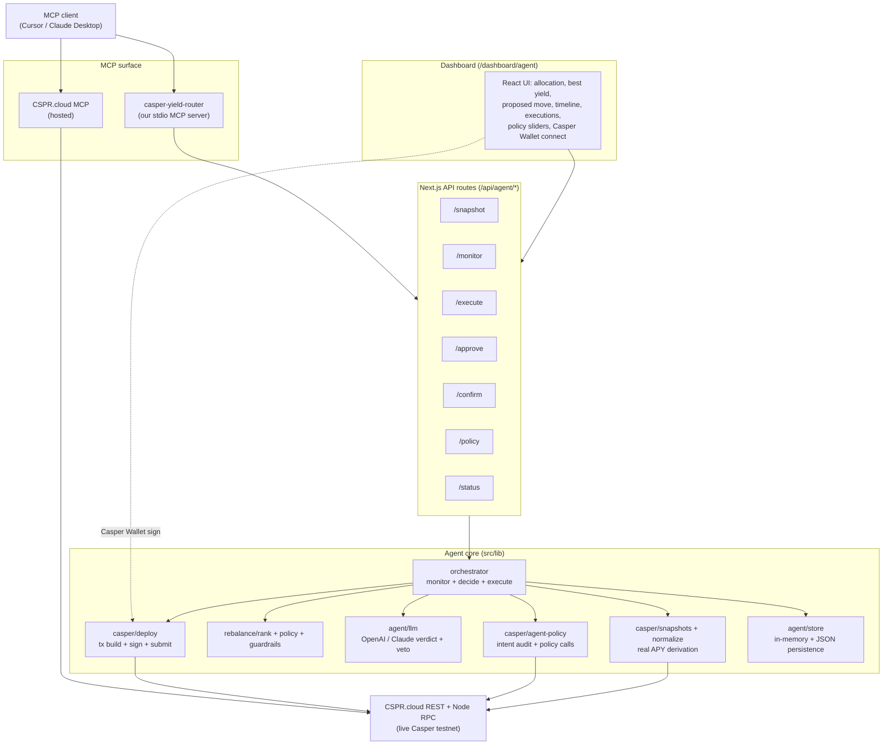

# Waffle Trade

**An autonomous, MCP-native yield-routing agent for the Casper blockchain.**

It turns a passive Casper wallet into a self-driving portfolio manager: it continuously **monitors** real staking yields across the network, **decides** where capital should sit using a risk-adjusted policy engine with an LLM in the loop, and **rebalances** funds on-chain — auto-signing small moves and asking a human to approve larger ones.

---

## What it does, in one loop

```
        ┌────────────────────────────────────────────────────────────┐
        │                                                            │
        ▼                                                            │
   ┌─────────┐      ┌──────────┐      ┌──────────┐      ┌──────────┐ │
   │ MONITOR │ ───► │  DECIDE  │ ───► │  APPROVE │ ───► │ REBALANCE│ ┘
   └─────────┘      └──────────┘      └──────────┘      └──────────┘
   live CSPR.cloud  rank + policy     LLM verdict +     delegate /
   staking data     + guardrails      hybrid signing    redelegate on-chain
```

1. **Monitor** — pull live, indexed Casper data from **CSPR.cloud** (validators, auction metrics, delegation rewards, DEX swaps) and normalize it into comparable yield snapshots.
2. **Decide** — rank venues by **risk-adjusted APY**, apply a user-configurable **policy**, run hard **guardrails**, and produce a concrete rebalance proposal with reasoning. An LLM (OpenAI or Claude) reviews the decision and can **veto** it.
3. **Rebalance** — build a native Casper delegation/redelegation transaction and either **auto-sign** it with a server session key (small moves) or return an **unsigned transaction** for **Casper Wallet** human approval (large moves). Submitted transactions are confirmed on-chain.
4. **Audit** — when the Waffle Trade Agent Policy contract is configured, auto-signed moves first write an on-chain intent hash to Waffle Trade's own Casper contract.

---

## The four things this project proves

| Pillar | How it's proven |
| --- | --- |
| **Really on Casper** | All reads come from live **CSPR.cloud** REST APIs (testnet). Positions are the account's **real** liquid balance + delegations. Writes are native `casper-js-sdk` v5 delegate/redelegate transactions submitted to a Casper node RPC, with `cspr.live` explorer links. |
| **Really deploying a contract** | Waffle Trade deploys its own **Agent Policy** contract on Casper testnet. Contract package hash: `892c0d5e717ace4befc2bad6dec3c7633c6ebb2eb97809b82168a3e5b92885a0`. |
| **Really using MCP** | The repo **authors its own MCP server** (`mcp-server/server.mjs`) exposing 11 agent tools over stdio, **and** can be paired with the hosted **CSPR.cloud MCP** server. Any MCP client (Cursor, Claude Desktop, Codex) can drive the full loop. |
| **Really autonomous** | A real monitor → decide → rebalance pipeline with policy, guardrails, an LLM verdict layer that can veto, cooldowns, and a hybrid auto/human signing model. A **server-side scheduler** (started at boot via `src/instrumentation.ts`) runs the whole loop unattended — no dashboard required. |

---

## Architecture



---

## How each layer works

### 1. Data layer — real Casper via CSPR.cloud
- `src/lib/casper/csprcloud.ts` — typed REST client for CSPR.cloud (validators, auction metrics, delegator rewards, DEXes, swaps, accounts, delegations, deploys).
- `src/lib/casper/positions.ts` — reads an account's **real** liquid balance + every active delegation and maps them into agent positions.
- `src/lib/casper/normalize.ts` + `snapshots.ts` + `reserves.ts` — derive comparable APYs:
  - **Staking APY** = network gross staking APY (derived from the connected account's *own* reward stream ÷ its *own* delegated stake) minus each validator's commission.
  - **LP/DEX APY** = real, reserve-based. `reserves.ts` reads a pool's on-chain reserves (a pair's token balance = the balance held by the pair contract package hash via CSPR.cloud `ft-token-ownership`), prices **both** sides in CSPR (WCSPR = 1; every other token via its latest DEX rate against WCSPR), and computes `TVL = Σ(reserve × priceInCspr)` and `APY = annualized trailing fees / TVL`. When only one side can be priced it falls back to the AMM equal-value identity (`TVL ≈ 2 × known side`); if nothing can be priced the APY is zeroed so it never pollutes the ranking.
  - Every CSPR-paired LP snapshot also carries **executable** metadata (`lp`: token hash, decimals, on-chain reserves) tagged `lp_execution_session_key_saga`, so LP venues are not just rankable — the agent can actually enter them (see the LP execution layer below). Non-CSPR pairs stay ranking-only (`lp_execution_unavailable_non_cspr_pair`).

### 1b. LP execution — real CSPR.trade router integration (enter **and** exit)
- `src/lib/casper/dex.ts` — builds every transaction the agent needs:
  - **enter**: `swap_exact_cspr_for_tokens`, CEP-18 `approve`, `add_liquidity_cspr`. CSPR.trade is a Uniswap-V2-style AMM; sending native CSPR into the router requires its `proxy_caller` session WASM (`src/lib/casper/wasm/proxy_caller.wasm`) that funds a purse and forwards the call. The router package/entry-point signatures and the packed `List<U8>` argument encoding were reverse-engineered from a live on-chain call and verified byte-for-byte via `query_global_state`.
  - **exit**: `approve` (on the LP/pair token) + `remove_liquidity_cspr`. Exiting attaches **no** CSPR (value flows out), so it's a **direct** router call, not a `proxy_caller` session.
- **On-chain quoting**: `quoteAmountOut` / `quoteRemoveLiquidity` / `priceImpactBps` replicate the router's `get_amounts_out` math and are applied to reserves **re-read fresh at quote/execute time** (`readLivePairReserves`, `readPairTotalSupply` in `reserves.ts`). Casper has no `eth_call`-style read-only contract call, so exact pricing means running the same constant-product formula the router uses against current on-chain reserves. Quotes report `reserveSource: "live_onchain"` and an estimated `priceImpactBps`.
- `src/lib/agent/lp.ts`:
  - **deposit saga**: swap half the CSPR → approve the router → `add_liquidity_cspr`. Each step is signed with the session key and confirmed on-chain before the next runs (steps 2–3 depend on the swap output).
  - **exit saga**: approve the router on the LP token → `remove_liquidity_cspr`, burning `percent` (or explicit `liquidity`) of the held LP and returning the paired token + native CSPR to the wallet, quoted pro-rata against fresh reserves × total supply.
  - `getHeldLpPositions` surfaces the LP positions the session account actually holds (with a rough CSPR value), so exits are discoverable.
- Endpoints: `POST /api/agent/lp/quote` + `/execute` (enter), `GET /api/agent/lp/positions`, `POST /api/agent/lp/withdraw/quote` + `/withdraw/execute` (exit) — all guarded by pause/stop/allowed-kinds/max-move. The orchestrator routes any `lp:` rebalance **destination** into the deposit saga and any `lp:` **source** into the exit saga.
- **Proven on testnet** (session key `01eb3702…`): swap [`21e2eda7…`], approve [`0e30e69a…`], `add_liquidity_cspr` [`30eb71a8…`] → LP tokens received. Because a full entry is three transactions, LP execution is **session-key only** (three wallet pop-ups with on-chain waits would be impractical for the human-approval path).
- ⚠️ Trust note: `proxy_caller.wasm` is CSPR.trade's session binary, vendored from a public reference implementation. It sits in the signing path, so for mainnet replace it with the official binary from CSPR.trade.

### 2. Decision engine
- `src/lib/rebalance/rank.ts` — `riskAdjustedApy` and `rankVenues` sort venues by yield discounted for risk (`riskAversion`).
- `src/lib/rebalance/policy.ts` — `proposeRebalance` picks the single move with the largest expected annual gain that clears the `minYieldDelta` risk-adjusted threshold, sized against caps.
- `src/lib/rebalance/guardrails.ts` — hard safety checks: max move size, per-venue allocation cap, cooldown, minimum remaining liquidity.

### 3. LLM in the loop (OpenAI **or** Claude)
- `src/lib/agent/llm.ts` — the deterministic engine remains the source of truth for numbers and guardrails; the LLM is given the fully-computed context and returns a structured verdict `{ verdict: "proceed" | "hold", rationale, confidence }`.
- A `hold` verdict **vetoes** auto-execution even for an otherwise-valid move.
- Provider is auto-selected: uses **OpenAI** when `OPENAI_API_KEY` is set, otherwise **Claude** (`CLAUDE_API_KEY`). Force one with `LLM_PROVIDER`. If no key/credits, the agent degrades gracefully and keeps running deterministically.

### 4. Hybrid signing + execution
- `src/lib/casper/deploy.ts` — builds native **delegate** (from idle balance) and **redelegate** (validator → validator) transactions with `casper-js-sdk` v5, and submits via CSPR.cloud node RPC.
- **Auto path**: moves ≤ `autoSignLimitCspr` are signed by a server-side session key (`src/lib/casper/keys.ts`) and submitted automatically.
- **Human path**: larger moves return an **unsigned transaction**; the dashboard signs it with **Casper Wallet** and posts the signature back to `/api/agent/approve`, which reattaches it and submits.
- `/api/agent/confirm` polls submitted transactions and flips them to `confirmed` / `failed`, with `cspr.live` explorer links as execution proof.

### 4b. On-chain Agent Policy contract
- `contracts/agent-policy` — Waffle Trade's own Casper contract. It is non-custodial: funds stay in the wallet/session account, while the contract stores automation limits and audit intent hashes.
- Entry points: `register_policy`, `update_policy`, `pause_policy`, `resume_policy`, `revoke_policy`, `record_intent`.
- `src/lib/casper/agent-policy.ts` builds contract calls. When `WAFFLE_AGENT_POLICY_PACKAGE_HASH` is set, auto-signed executions record an intent hash on-chain before the staking/LP move.
- **Deployed on Casper testnet**
  - Contract package hash / address: `892c0d5e717ace4befc2bad6dec3c7633c6ebb2eb97809b82168a3e5b92885a0`
  - Contract hash, version 1: `40bef91727b6269c78901f520c30a8e67e8918f4d94b95629dd16df394c26d96`
  - Install deploy: `db66f58010d200e52651fa60b1e53d8e13190ad5e9c346fc0066c543bce9405b`
  - Policy registration tx: `45ee5ed6cd47f9ef2e8216fad2906a94bcbb71ea8b4844d7ae7e39703690ade9`
  - Session/owner account: `01eb3702ce31b925f082a9e4a6d66d99e4c6f8d1d549137c1e0ed8e24d7d6f09fa`
- Deploy flow:
  ```bash
  rustup target add wasm32v1-none --toolchain nightly
  cargo +nightly build --release --target wasm32v1-none --manifest-path contracts/agent-policy/Cargo.toml
  node --env-file=.env scripts/deploy-agent-policy.mjs
  ```
  The deploy script uses a legacy Casper deploy (`Deploy.makeDeploy` + `putDeploy`) because contract installation calls `add_contract_version`, which must run in an installer/upgrader deploy context. Add the printed package hash to `.env` as `WAFFLE_AGENT_POLICY_PACKAGE_HASH`, then call `POST /api/agent/onchain-policy` with `{ "action": "register" }`.

### 5. MCP surface
- **Our server** (`mcp-server/server.mjs`, stdio) exposes 11 tools over the agent API:
  - `get_yield_snapshot` — live risk-adjusted venue ranking
  - `get_wallet_state` — allocation, positions, connected account, auto-sign status
  - `get_agent_status` — policy, positions, decision log, executions
  - `propose_rebalance` — run one monitor → decide cycle (no execution)
  - `execute_rebalance` — execute/prepare a proposal (auto-sign or return unsigned tx)
  - `get_lp_pools` — executable CSPR-paired pools with real reserves + APY
  - `quote_lp_deposit` / `execute_lp_deposit` — preview and run the LP **entry** saga
  - `get_lp_positions` — LP positions the session account holds (exitable)
  - `quote_lp_withdraw` / `execute_lp_withdraw` — preview and run the LP **exit** saga
- An LLM can therefore do the full LP lifecycle over MCP: discover pools → enter → check positions → exit.
- **Hosted CSPR.cloud MCP** can be added alongside the local server for direct, on-chain data access from the same MCP client.

### 6. Dashboard (`/dashboard/agent`)
Live view of the agent: current allocation (pie), best yield opportunities, the proposed move + reasoning, the **AI verdict** panel, the decision timeline, execution history with explorer links (each LP saga step links to its transaction), and policy sliders (min yield delta, max allocation, auto-sign limit, risk aversion) plus pause / emergency-stop controls and Casper Wallet connect. Dedicated **Provide liquidity** (enter) and **Exit liquidity** (withdraw) panels drive the CSPR.trade sagas with live on-chain quotes. An **Autonomy loop** badge shows whether the server-side scheduler is live and when it last ticked.

### 7. Background autonomy (`src/instrumentation.ts` + `src/lib/agent/scheduler.ts`)
This is what makes the agent genuinely **self-driving**. A server-side scheduler starts on server boot (via Next.js's instrumentation hook) and runs the full **monitor → decide → execute** cycle on a fixed interval **with no dashboard open**:

- Ticks every `autonomyIntervalSec` (default 60s; editable at runtime via `/policy`).
- Only acts when the agent is `running` and not paused / emergency-stopped.
- Executes (not just decides) only when the persisted `autoExecute` flag is on — and then only for auto-signable, non-vetoed proposals; all normal guardrails still apply.
- Never overlaps ticks (a long LP saga won't be re-entered), and reports health (`lastTickAt`, `lastSummary`, `lastError`, `tickCount`) through `/status`.
- Because the scheduler and API routes run in separate bundles, the JSON state file is the shared source of truth (mtime-based reload), so dashboard toggles and scheduler writes stay in sync.

Disable it with `AGENT_SCHEDULER=off`. The dashboard's 15s polling is now display-only; the loop itself runs on the server.

---

## Safety model

- **Guardrails** — max move size, per-venue allocation cap, cooldown between moves, minimum remaining liquidity.
- **Auto-sign limit** — only small moves auto-execute; anything larger requires explicit Casper Wallet approval.
- **LLM veto** — the reasoning layer can block a move it considers unsound.
- **Pause / emergency stop** — global kill switches; emergency stop also halts the run loop (including the background scheduler).
- **Secrets stay server-side** — the CSPR.cloud token, LLM keys, and any session key are never exposed to the browser.

---

## Project structure

```
src/
├─ app/
│  ├─ (main)/dashboard/agent/page.tsx    # the agent dashboard UI
│  └─ api/agent/                         # snapshot, monitor, execute, approve, confirm, policy, onchain-policy, status
├─ lib/
│  ├─ casper/                            # config, csprcloud, positions, normalize, snapshots, deploy, keys, agent-policy
│  ├─ rebalance/                         # types, rank, policy, guardrails (decision engine)
│  └─ agent/                             # orchestrator, store, llm, client
contracts/
└─ agent-policy/                         # Waffle Trade Agent Policy Casper contract
mcp-server/
├─ server.mjs                            # our Casper Yield-Router MCP server (stdio)
└─ test-client.mjs                       # smoke test for the MCP server
scripts/
├─ casper-discovery.mjs                  # probe CSPR.cloud endpoints / verify the API key
├─ deploy-agent-policy.mjs               # install the Agent Policy contract
└─ read-agent-policy-package.mjs         # read the installed package hash helper
```

---

## API reference (`/api/agent`)

| Route | Method | Purpose |
| --- | --- | --- |
| `/snapshot` | GET | Normalized, risk-adjusted venue ranking (`?validators=8&lp=true&ref=<pk>`) |
| `/status` | GET | Full agent state: policy, positions, decisions, executions, and background **scheduler** health |
| `/monitor` | POST | Run one monitor → decide cycle (`{ mode, autoExecute }`); optionally auto-execute |
| `/execute` | POST | Execute/prepare a proposal (auto-sign or return unsigned tx) |
| `/approve` | POST | Submit a Casper Wallet-signed tx, or reject a pending move |
| `/confirm` | POST | Check a submitted tx's on-chain status and finalize the record |
| `/policy` | POST | Update policy/controls (incl. `autoExecute`, `autonomyIntervalSec` for the background loop); on connect, loads real on-chain positions |
| `/onchain-policy` | GET/POST | Read Agent Policy contract config, or submit `register`, `update`, `pause`, `resume`, `revoke` transactions |
| `/lp/quote` · `/lp/execute` | POST | Preview / run the LP **entry** saga (on-chain quoted) |
| `/lp/positions` | GET | LP positions the session account holds (exitable) |
| `/lp/withdraw/quote` · `/lp/withdraw/execute` | POST | Preview / run the LP **exit** saga (`remove_liquidity_cspr`) |

---

## Setup

**Prerequisites:** Node.js 18+ and a [CSPR.cloud](https://cspr.cloud/) access token (free, testnet). To rebuild/redeploy the Casper contract, install Rust nightly with the `wasm32v1-none` target.

```bash
npm install
cp .env.example .env   # then fill in the values below
```

### Environment variables

| Variable | Required | Notes |
| --- | --- | --- |
| `CSPR_CLOUD_API_KEY` | | CSPR.cloud access token. Server-side only. |
| `CASPER_NETWORK` |  | `testnet` (default) or `mainnet`. |
| `OPENAI_API_KEY` |  | Enables the OpenAI reasoning layer (preferred when set). |
| `CLAUDE_API_KEY` |  | Alternative reasoning provider. |
| `LLM_PROVIDER` |  | Force `openai` or `anthropic`. |
| `OPENAI_MODEL` / `CLAUDE_MODEL` |  | Override the model (defaults: `gpt-4o-mini` / `claude-3-5-sonnet-latest`). |
| `CASPER_SESSION_PRIVATE_KEY_HEX` / `_PEM` | | Optional funded session key to enable **auto-signed** on-chain moves. Without it, every move needs Casper Wallet approval. |
| `AGENT_API_BASE` |  | Base URL the MCP server uses to reach the app (default `http://localhost:3001`). |
| `WCSPR_CONTRACT_PACKAGE_HASH` | | WCSPR package hash for LP pricing/execution (testnet built in; set for mainnet). |
| `CSPR_TRADE_ROUTER_PACKAGE_HASH` | | CSPR.trade router package for LP execution (testnet built in; set for mainnet). |
| `WAFFLE_AGENT_POLICY_PACKAGE_HASH` | | Waffle Trade Agent Policy contract package hash. Enables on-chain policy registration and intent auditing. |

> The agent works read-only with just `CSPR_CLOUD_API_KEY`. Add an LLM key to enable the reasoning/veto layer, and a session key (or use Casper Wallet) to execute real transactions.

### Agent Policy contract

The current testnet deployment is already configured with:

```env
WAFFLE_AGENT_POLICY_PACKAGE_HASH=892c0d5e717ace4befc2bad6dec3c7633c6ebb2eb97809b82168a3e5b92885a0
```

To rebuild and redeploy it:

```bash
rustup target add wasm32v1-none --toolchain nightly
cargo +nightly build --release --target wasm32v1-none --manifest-path contracts/agent-policy/Cargo.toml
node --env-file=.env scripts/deploy-agent-policy.mjs
```

After setting the printed `WAFFLE_AGENT_POLICY_PACKAGE_HASH`, register or update the account policy:

```bash
curl -X POST http://localhost:3000/api/agent/onchain-policy \
  -H "Content-Type: application/json" \
  -d '{"action":"register"}'
```

Use `{"action":"update"}`, `{"action":"pause"}`, `{"action":"resume"}`, or `{"action":"revoke"}` for lifecycle control.

### Run

```bash
npm run dev      # http://localhost:3000  (uses next available port if 3000 is taken)
```

Then open **`/dashboard/agent`**, connect Casper Wallet (or paste a public key) to load real positions, and click **Run** / **Execute rebalance**.

Verify your CSPR.cloud connection at any time:

```bash
node --env-file=.env scripts/casper-discovery.mjs
```

---

## Using it from an MCP client (Cursor / Claude Desktop)

1. Start the app (`npm run dev`) so the agent API is live.
2. Register the local MCP server in your client:
   - `casper-yield-router` — `node --env-file=.env mcp-server/server.mjs`
   - optional: add the hosted CSPR.cloud MCP server in the same client for direct chain-data tools
3. In your MCP client, call the tools:
   - **Staking loop:** `get_yield_snapshot`, `get_wallet_state`, `get_agent_status`, `propose_rebalance`, `execute_rebalance`.
   - **LP (CSPR.trade):** `get_lp_pools` (executable CSPR-paired pools), `quote_lp_deposit` (preview split/slippage/gas, read-only), `execute_lp_deposit` (runs the swap → approve → `add_liquidity_cspr` saga). So an LLM can discover, preview, and enter an LP position entirely through MCP.

Smoke-test the MCP server directly:

```bash
node --env-file=.env mcp-server/test-client.mjs
```

---

## Demo flow

1. Connect a Casper account → the agent loads its **real** balance and delegations.
2. **Monitor** pulls live validator yields from CSPR.cloud and ranks them.
3. **Decide** proposes a move with reasoning; the LLM adds a verdict (and may veto).
4. Small move → **auto-signed** and submitted. Large move → **Casper Wallet** approval.
5. When the Agent Policy contract is configured, the agent records an on-chain intent hash before auto execution.
6. The execution appears in the timeline with a **cspr.live** explorer link, then flips to **confirmed**.
7. **Provide liquidity · CSPR.trade** → pick a CSPR-paired pool, preview the split, and **Deposit** — the agent runs the swap → approve → `add_liquidity_cspr` saga, each step showing its own explorer link as it confirms, ending with LP tokens in the account.

---

## Roadmap

- **LP execution routing** — ✅ done. Real CSPR.trade router integration for both **entry** (swap → approve → `add_liquidity_cspr`, proven on testnet) and **exit** (approve → `remove_liquidity_cspr`), with **on-chain quoting** (the router's `get_amounts_out` math applied to fresh reserves + total supply, reported as `reserveSource: live_onchain` with price impact). Next: multi-hop routing and automatic loop-driven LP↔staking rebalancing once held LP positions are tracked as first-class portfolio positions.
- **Agent Policy contract** — ✅ done. Waffle Trade's own non-custodial Casper contract stores policy metadata and intent hashes. Deployed package hash: `892c0d5e717ace4befc2bad6dec3c7633c6ebb2eb97809b82168a3e5b92885a0`. Next: richer on-chain policy reads in the dashboard.
- **Background autonomy** — ✅ done. Server-side scheduler runs the monitor → decide → execute loop unattended (no dashboard needed), started at boot via the Next.js instrumentation hook. Next: durable job queue / cron-backed persistence for multi-instance deployments.
- **x402 / delegated authorization** — scoped, revocable auto-signing grants instead of a raw session key.
- **Streaming** — CSPR.cloud WebSocket for push-based monitoring.

---

## Tech stack

Next.js 14 (App Router) · TypeScript · Tailwind CSS · `casper-js-sdk` v5 · CSPR.cloud REST + Node RPC · Model Context Protocol (`@modelcontextprotocol/sdk`) · OpenAI / Anthropic · Recharts.

---

## Disclaimer

This is a demo/hackathon project running on Casper **testnet**. It is not financial advice and not audited. Use real funds at your own risk.
