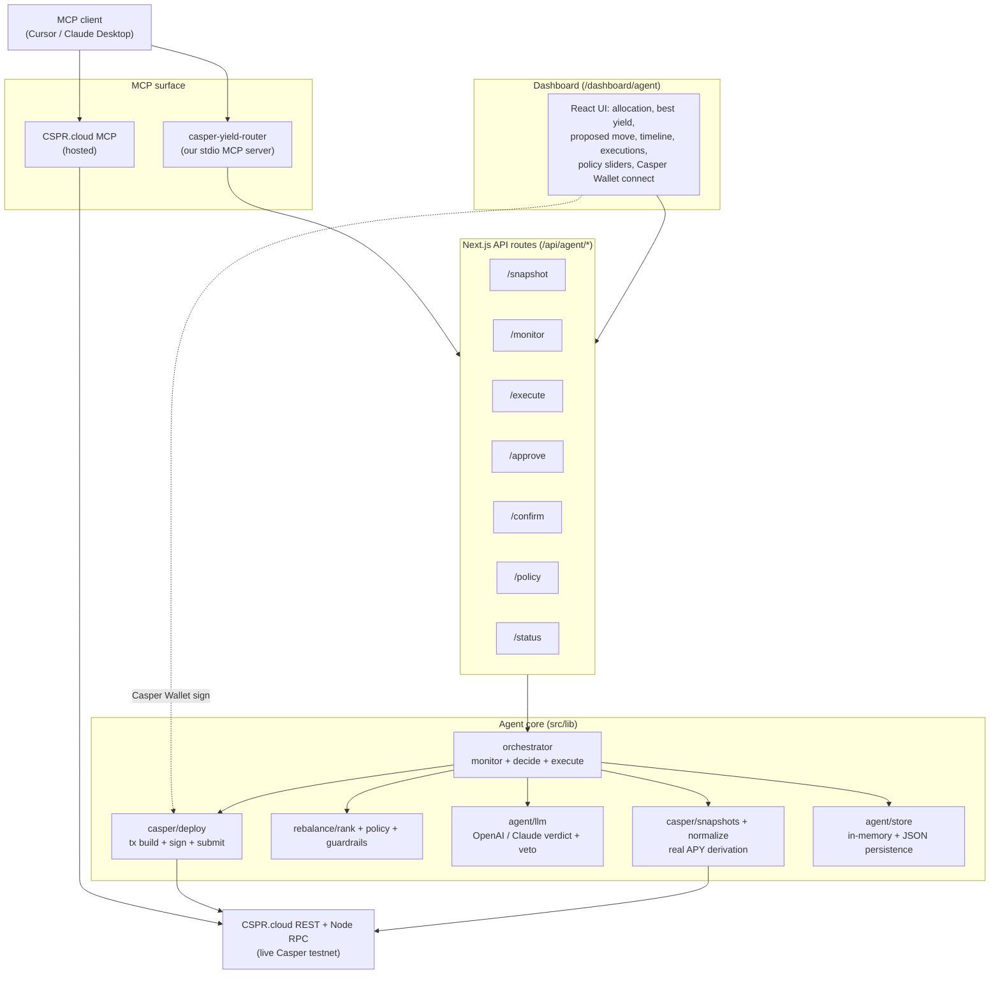

# Casper Yield Router

**An autonomous, MCP-native yield-routing agent for the Casper blockchain.**

It turns a passive Casper wallet into a self-driving portfolio manager: it continuously **monitors** real staking yields across the network, **decides** where capital should sit using a risk-adjusted policy engine with an LLM in the loop, and **rebalances** funds on-chain — auto-signing small moves and asking a human to approve larger ones.

---

## What it does, in one loop

```
        ┌────────────────────────────────────────────────────────────┐
        │                                                            │
        ▼                                                            │
   ┌─────────┐      ┌──────────┐      ┌──────────┐      ┌──────────┐ │
   │ MONITOR │ ───► │  DECIDE  │ ───► │  APPROVE │ ───► │ REBALANCE│ ┘
   └─────────┘      └──────────┘      └──────────┘      └──────────┘
   live CSPR.cloud  rank + policy     LLM verdict +     delegate /
   staking data     + guardrails      hybrid signing    redelegate on-chain
```

1. **Monitor** — pull live, indexed Casper data from **CSPR.cloud** (validators, auction metrics, delegation rewards, DEX swaps) and normalize it into comparable yield snapshots.
2. **Decide** — rank venues by **risk-adjusted APY**, apply a user-configurable **policy**, run hard **guardrails**, and produce a concrete rebalance proposal with reasoning. An LLM (OpenAI or Claude) reviews the decision and can **veto** it.
3. **Rebalance** — build a native Casper delegation/redelegation transaction and either **auto-sign** it with a server session key (small moves) or return an **unsigned transaction** for **Casper Wallet** human approval (large moves). Submitted transactions are confirmed on-chain.

---

## The three things this project proves

| Pillar | How it's proven |
| --- | --- |
| **Really on Casper** | All reads come from live **CSPR.cloud** REST APIs (testnet). Positions are the account's **real** liquid balance + delegations. Writes are native `casper-js-sdk` v5 delegate/redelegate transactions submitted to a Casper node RPC, with `cspr.live` explorer links. |
| **Really using MCP** | The repo **authors its own MCP server** (`mcp-server/server.mjs`) exposing 5 agent tools over stdio, **and** consumes the **hosted CSPR.cloud MCP** server. Any MCP client (Cursor, Claude Desktop, Codex) can drive the full loop. |
| **Really autonomous** | A real monitor → decide → rebalance pipeline with policy, guardrails, an LLM verdict layer that can veto, cooldowns, and a hybrid auto/human signing model. |

---

## Architecture



---

## How each layer works

### 1. Data layer — real Casper via CSPR.cloud
- `src/lib/casper/csprcloud.ts` — typed REST client for CSPR.cloud (validators, auction metrics, delegator rewards, DEXes, swaps, accounts, delegations, deploys).
- `src/lib/casper/positions.ts` — reads an account's **real** liquid balance + every active delegation and maps them into agent positions.
- `src/lib/casper/normalize.ts` + `snapshots.ts` — derive comparable APYs:
  - **Staking APY** = network gross staking APY (derived from the connected account's *own* reward stream ÷ its *own* delegated stake) minus each validator's commission.
  - **LP/DEX** venues are computed from swap volume and flagged as informational (`apy_is_fee_intensity_not_comparable`) — off by default until pool reserves are wired.

### 2. Decision engine
- `src/lib/rebalance/rank.ts` — `riskAdjustedApy` and `rankVenues` sort venues by yield discounted for risk (`riskAversion`).
- `src/lib/rebalance/policy.ts` — `proposeRebalance` picks the single move with the largest expected annual gain that clears the `minYieldDelta` risk-adjusted threshold, sized against caps.
- `src/lib/rebalance/guardrails.ts` — hard safety checks: max move size, per-venue allocation cap, cooldown, minimum remaining liquidity.

### 3. LLM in the loop (OpenAI **or** Claude)
- `src/lib/agent/llm.ts` — the deterministic engine remains the source of truth for numbers and guardrails; the LLM is given the fully-computed context and returns a structured verdict `{ verdict: "proceed" | "hold", rationale, confidence }`.
- A `hold` verdict **vetoes** auto-execution even for an otherwise-valid move.
- Provider is auto-selected: uses **OpenAI** when `OPENAI_API_KEY` is set, otherwise **Claude** (`CLAUDE_API_KEY`). Force one with `LLM_PROVIDER`. If no key/credits, the agent degrades gracefully and keeps running deterministically.

### 4. Hybrid signing + execution
- `src/lib/casper/deploy.ts` — builds native **delegate** (from idle balance) and **redelegate** (validator → validator) transactions with `casper-js-sdk` v5, and submits via CSPR.cloud node RPC.
- **Auto path**: moves ≤ `autoSignLimitCspr` are signed by a server-side session key (`src/lib/casper/keys.ts`) and submitted automatically.
- **Human path**: larger moves return an **unsigned transaction**; the dashboard signs it with **Casper Wallet** and posts the signature back to `/api/agent/approve`, which reattaches it and submits.
- `/api/agent/confirm` polls submitted transactions and flips them to `confirmed` / `failed`, with `cspr.live` explorer links as execution proof.

### 5. MCP surface
- **Our server** (`mcp-server/server.mjs`, stdio) exposes 5 tools over the agent API:
  - `get_yield_snapshot` — live risk-adjusted venue ranking
  - `get_wallet_state` — allocation, positions, connected account, auto-sign status
  - `get_agent_status` — policy, positions, decision log, executions
  - `propose_rebalance` — run one monitor → decide cycle (no execution)
  - `execute_rebalance` — execute/prepare a proposal (auto-sign or return unsigned tx)
- **Hosted CSPR.cloud MCP** is wired in `.cursor/mcp.json` for direct, on-chain data access from the same client.

### 6. Dashboard (`/dashboard/agent`)
Live view of the agent: current allocation (pie), best yield opportunities, the proposed move + reasoning, the **AI verdict** panel, the decision timeline, execution history with explorer links, and policy sliders (min yield delta, max allocation, auto-sign limit, risk aversion) plus pause / emergency-stop controls and Casper Wallet connect.

---

## Safety model

- **Guardrails** — max move size, per-venue allocation cap, cooldown between moves, minimum remaining liquidity.
- **Auto-sign limit** — only small moves auto-execute; anything larger requires explicit Casper Wallet approval.
- **LLM veto** — the reasoning layer can block a move it considers unsound.
- **Pause / emergency stop** — global kill switches; emergency stop also halts the run loop.
- **Secrets stay server-side** — the CSPR.cloud token, LLM keys, and any session key are never exposed to the browser.

---

## Project structure

```
src/
├─ app/
│  ├─ (main)/dashboard/agent/page.tsx    # the agent dashboard UI
│  └─ api/agent/                         # snapshot, monitor, execute, approve, confirm, policy, status
├─ lib/
│  ├─ casper/                            # config, csprcloud, positions, normalize, snapshots, deploy, keys
│  ├─ rebalance/                         # types, rank, policy, guardrails (decision engine)
│  └─ agent/                             # orchestrator, store, llm, client
mcp-server/
├─ server.mjs                            # our Casper Yield-Router MCP server (stdio)
└─ test-client.mjs                       # smoke test for the MCP server
scripts/
└─ casper-discovery.mjs                  # probe CSPR.cloud endpoints / verify the API key
.cursor/mcp.json                         # wires our MCP server + hosted CSPR.cloud MCP
```

---

## API reference (`/api/agent`)

| Route | Method | Purpose |
| --- | --- | --- |
| `/snapshot` | GET | Normalized, risk-adjusted venue ranking (`?validators=8&lp=true&ref=<pk>`) |
| `/status` | GET | Full agent state: policy, positions, decisions, executions |
| `/monitor` | POST | Run one monitor → decide cycle (`{ mode, autoExecute }`); optionally auto-execute |
| `/execute` | POST | Execute/prepare a proposal (auto-sign or return unsigned tx) |
| `/approve` | POST | Submit a Casper Wallet-signed tx, or reject a pending move |
| `/confirm` | POST | Check a submitted tx's on-chain status and finalize the record |
| `/policy` | POST | Update policy/controls; on connect, loads real on-chain positions |

---

## Setup

**Prerequisites:** Node.js 18+ and a [CSPR.cloud](https://cspr.cloud/) access token (free, testnet).

```bash
npm install
cp .env.example .env   # then fill in the values below
```

### Environment variables

| Variable | Required | Notes |
| --- | --- | --- |
| `CSPR_CLOUD_API_KEY` | ✅ | CSPR.cloud access token. Server-side only. |
| `CASPER_NETWORK` | – | `testnet` (default) or `mainnet`. |
| `OPENAI_API_KEY` | – | Enables the OpenAI reasoning layer (preferred when set). |
| `CLAUDE_API_KEY` | – | Alternative reasoning provider. |
| `LLM_PROVIDER` | – | Force `openai` or `anthropic`. |
| `OPENAI_MODEL` / `CLAUDE_MODEL` | – | Override the model (defaults: `gpt-4o-mini` / `claude-3-5-sonnet-latest`). |
| `CASPER_SESSION_PRIVATE_KEY_HEX` / `_PEM` | – | Optional funded session key to enable **auto-signed** on-chain moves. Without it, every move needs Casper Wallet approval. |
| `AGENT_API_BASE` | – | Base URL the MCP server uses to reach the app (default `http://localhost:3001`). |

> The agent works read-only with just `CSPR_CLOUD_API_KEY`. Add an LLM key to enable the reasoning/veto layer, and a session key (or use Casper Wallet) to execute real transactions.

### Run

```bash
npm run dev      # http://localhost:3000  (uses next available port if 3000 is taken)
```

Then open **`/dashboard/agent`**, connect Casper Wallet (or paste a public key) to load real positions, and click **Run** / **Execute rebalance**.

Verify your CSPR.cloud connection at any time:

```bash
node --env-file=.env scripts/casper-discovery.mjs
```

---

## Using it from an MCP client (Cursor / Claude Desktop)

1. Start the app (`npm run dev`) so the agent API is live.
2. `.cursor/mcp.json` already registers two servers:
   - `casper-yield-router` — our stdio server (`node --env-file=.env mcp-server/server.mjs`)
   - `cspr_cloud_testnet` — the hosted CSPR.cloud MCP
3. In your MCP client, call tools like `get_yield_snapshot`, `propose_rebalance`, then `execute_rebalance`.

Smoke-test the MCP server directly:

```bash
node --env-file=.env mcp-server/test-client.mjs
```

---

## Demo flow

1. Connect a Casper account → the agent loads its **real** balance and delegations.
2. **Monitor** pulls live validator yields from CSPR.cloud and ranks them.
3. **Decide** proposes a move with reasoning; the LLM adds a verdict (and may veto).
4. Small move → **auto-signed** and submitted. Large move → **Casper Wallet** approval.
5. The execution appears in the timeline with a **cspr.live** explorer link, then flips to **confirmed**.

---

## Roadmap

- **LP pool reserves** — wire real pool TVL so DEX/LP APY becomes comparable and routable.
- **x402 / delegated authorization** — scoped, revocable auto-signing grants instead of a raw session key.
- **Streaming** — CSPR.cloud WebSocket for push-based monitoring.

---

## Tech stack

Next.js 14 (App Router) · TypeScript · Tailwind CSS · `casper-js-sdk` v5 · CSPR.cloud REST + Node RPC · Model Context Protocol (`@modelcontextprotocol/sdk`) · OpenAI / Anthropic · Recharts.

---

## Disclaimer

This is a demo/hackathon project running on Casper **testnet**. It is not financial advice and not audited. Use real funds at your own risk.
